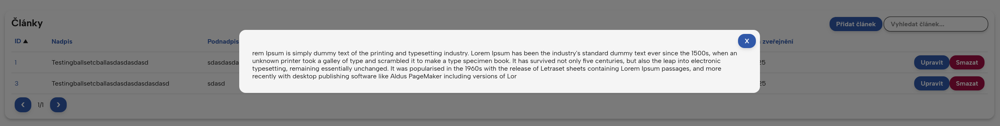
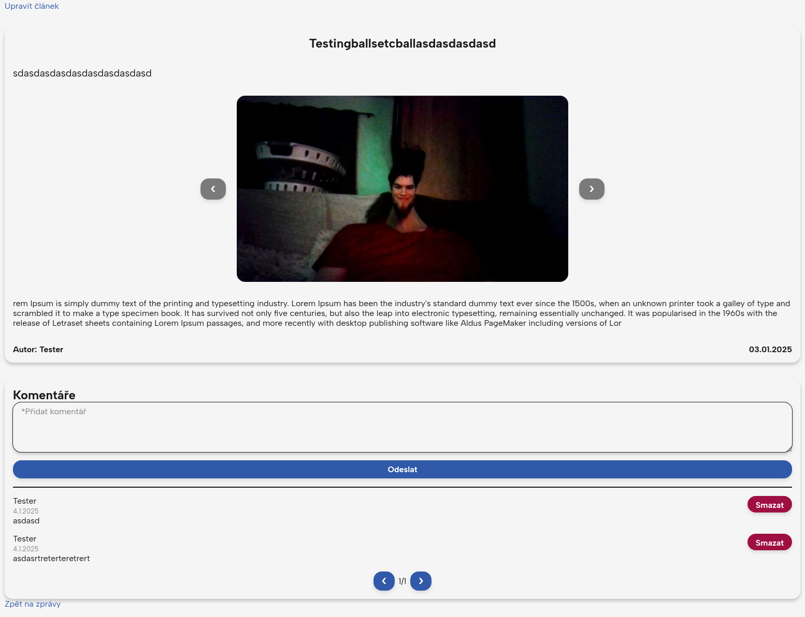

# User Documentation
**[Website Name Placeholder]** user documentation. This documentation explains how to use the website, what features it offers, and the structure of user ranks along with their permissions.

## Table of Contents
1. [Introduction](#introduction)
2. [Getting Started](#getting-started)
3. [Account Creation](#account-creation)
4. [Website Features](#website-features)
   - [Navigation](#navigation)
   - [Register](#register)
   - [Login](#login)
   - [User dashboard](#user-dashboard)
   - [User settings](#user-settings)
   - [Admin dashboard](#admin-dashboard)
   - [News](#news)
   - [Article](#article)
   - [Article add/edit page](#article-add-edit-page)
   - [User editing page](#user-editing-page)
   - [Search and Sort functionality](#search-and-sort-functionality)
5. [How to Perform Key Actions](#how-to-perform-key-actions)
   - [Registering](#registering) 
   - [Logging In](#logging-in)
   - [Changing your fullname](#changing-your-fullname)
   - [Changing your profile picture](#changing-your-profile-picture)
   - [Changing your password](#changing-your-password)
   - [Uploading articles](#uploading-articles)
   - [Editing articles](#editing-articles)
   - [Editing users](#editing-users)
6. [Additional information](#additional-information)
   - [User rank structure](#user-rank-structure) 
7. [Notes](#notes)
---

## Introduction
Welcome to **ZONMB** *Základní organizace neslyšících Mladá Boleslav*. This guide provides comprehensive instructions to help you navigate and use the website effectively.

## Getting started

### Requirements
- The website is not platform-limited
- Internet connection
- Web-browser
    - supported web-browsers are: Firefox and Chrome

### Account creation
1. Go to the **Sign-Up** page
2. Fill out the registration form
4. Log in to start using the website

## Website features
### Navigation

Use the main menu to access different sections of the website:
- **ZONMB** (Home):
    - Overview of the site
- **NOVINKY** (News):
    - See all published articles
- **PROFILE**:
    - This navigation element has two features depending on your login status
        - When you are logged in, you can access your account details and settings
        - Otherwise, this button leads to log in and registration page

### Register
Register form through which you can register on the platform
*All required inputs are marked with \*(star)*
- Username
    - must be at least 3 and up to 30 characters long
    - can contain only letters, numbers, dots and underscord
- Fullname
    - must be at least 3 and up to 30 characters long
    - can contain only letters and spaces
- Password & Password Confirmation
    - must be at least 8 and up to 255 characters long
    - can contain any character
- Profile picture upload (optional)
    - must be of type jpeg or png
    - up to 2MB in size
    - at least 200x200 px and up to 4000x4000px
- Additionally, there is a login page link

### Login
Login form through which you log in to the platform using your registered credentials
*All required inputs are marked with \*(star)*
- Username
- Password
- Additionally, there is a register page link

### User dashboard

An overview of your account details and user management
- See your account username, fullname and profile picture
- Update your personal information
- Change your password

Additionally, admin dashboard link will show up when logged-in user is an owner or admin

#### User settings
Change Fullname

Change profile picutre

Change password

### Admin dashboard
An overview of all users and articles, user can sort (by clicking on any the top row item) and search data in each section, additionally there is an add article button

There are also a page navigation buttons at the bottom, to scroll throughout the pages of each table

Users table contains and ID, Username, Fullname, Role, Profile picture path, and Date of Registration for each user
(Additionally clicking on image path, user can display an actual image that said image path points to)

Articles table contains and ID, Title, Subtitle, Content, Image paths, Author ID and Date of Creation for each article.

By clicking on any item inside articles table, you can open a detailed overlay to display all data inside the element.

### News
Page where all published articles are displayed, they can be searched or sorted Alphabetically or by creation date.

There are also a page navigation buttons at the bottom, to scroll throughout the articles.

### Article
Article page where all data of article are displayed, including the title, subtitle, images, content and author name an creation date.

There is also a backlink to news page and a link to directly edit opened article.

If an article contains multiple images, user can cycle through them using image slide arrows.

### Article add edit page
Page for adding or editing articles, any input can contain any character, so feel free to go wild ;)
- Title
    - must be at least 10 and up to 100 characters long
- Subtitle
    - must be at least 3 and up to 255 characters long
- Content
    - must be at least 3 and up to 5000 characters long
- Pictures (optional)
    - images must be of type jpeg or png
    - each image can be up to 2MB
    - each image must be at least 200x200 and up to 4000x4000px

Additionally, when editing an article with images, user can click on a small X near the image to directly delete it.

### User editing page
Page for editing basic user details, admin can edit users "rank", set user either to user/editor, owner can set any rank except owner.
- ID
    - informative and cannot be changed
- Username
    - cannot be changed, users login to the platform using this string
- Fullname
    - can be edited
- Profile picture
    - can be deleted if inappropriate

Here you can also delete a users profile picture by clicking on a small X near the image.
See [user rank structure](#user-rank-structure) for more information on who can edit who

### Search and Sort functionality
News and Admin Dashboard sections contain a Search and Sort functionality.

Type any words or characters inside the search bar to find the article

Sort items by selecting prefered sort item

## How to Perform Key Actions
### Registering
1. Navigate to the [Register](#) page
2. Fill out the form with your:
    - Username
    - Fullname
    - Passwords
    - (optionally) Profile picture
3. Click **Login**

### Logging In
1. Navigate to the [Login](#) page
2. Enter your username and password
3. Click **Login**

### Changing your fullname
1. Navigate to the **Userpage** via top right link in the header
2. Navigate to change fullname section
3. Fill out your new fullname
4. Click **Change Fullname**

### Changing your profile picture
1. Navigate to the **Userpage** via top right link in the header
2. Navigate to change profile picture section
3. Upload your new image
4. Click **Change Fullname**

### Changing your password
1. 1. Navigate to the **Userpage** via top right link in the header
2. Navigate to change password section
3. Fill out the form with your old password and new password
4. Click **Change password**

### Uploading articles
1. Access the article upload page either via admin dashboard or news page
2. Locate the **Add article** button and click on it
3. Fill out the article details like title, subtitle etc..
4. Click **Publish**

### Editing articles
1. Access the article editing page either via admin dashboard or news page
2. Locate the **Edit** button and click on it
3. Fill out the article details like title, subtitle etc..
4. Click **Edit**

### Editing users
1. Access the user editing page via admin dashboard
2. Locate the **Edit** button next to a user you want to edit and click on it
3. Fill out the article details like title, subtitle etc..
4. Click **Edit**

## Additional information
### User rank structure
Here is the list of ranks and their abilities

**Users**
- Login
- Change account details

**Editor**
- All of the above and:
- Adding / Removing / Editing articles

**Admin**
- All of the above and:
- Adding / Removing / Editing articles
- Editing / Removing users of lower rank e.g. editors and users

**Owner**
- All of the above and:
- Adding / Removing / Editing articles
- Editing / Removing users except other owners
- *Owner can be assigned only manually using database*

## Notes
**Author -** Erik Vaněk
- Webpage: [https://github.com/NeDDy3z](https://github.com/NeDDy3z)
- Email: [erikvanek0@gmail.com](mailto:erikvanek0@gmail.com)
    - Also feel free to contact me for any details including support and throubleshooting

*This is a semester project of the ZWA subject for the first semester at ČVUT FEL - SIT, focusing on web-development. The plan for this project is to be used by the ZONMB organization, based in Mladá Boleslav, with which I collaborate.*

*12.25.2024*